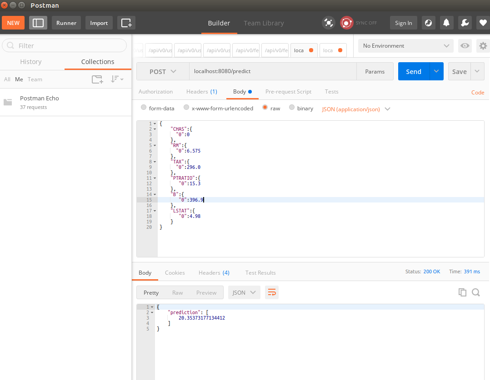

# Overview

<TODO: complete this with an overview of your project>
In this project we are going to demonstrate the use of : CI (Continuous Integration) and CD (Continuous Delivery).

We will build a Github repository that will assist in performing both Continuous Integration and Continuous Delivery. We'll use Github Actions along with a Makefile, requirements.txt and application code to perform an initial lint, test, and install cycle. Next, we'll integrate this project with Azure Pipelines to enable Continuous Delivery to Azure App Service.

This project will give us the opportunity to demonstrate our ability to perform continuous delivery for a Python-based machine learning application using the Flask web framework. We will apply the skills acquired in this course to operationalize a Machine Learning Microservice API.

The project makes us of a pre-trained, sklearn model that has been trained to predict housing prices in Boston according to several features, such as average rooms in a home and data about highway access, teacher-to-pupil ratios, and so on. YThe data used here was initially taken from Kaggle, on the [data source site](https://www.kaggle.com/c/boston-housing). This project tests your ability to operationalize a Python flask app—in a provided file, app.py—that serves out predictions (inference) about housing prices through API calls.

## Project Plan
<TODO: Project Plan

* A link to a Trello board for the project
* A link to a spreadsheet that includes the original and final project plan>

## Instructions

<TODO:  
* Architectural Diagram (Shows how key parts of the system work)>

<TODO:  Instructions for running the Python project.  How could a user with no context run this project without asking you for any help.  Include screenshots with explicit steps to create that work. Be sure to at least include the following screenshots:

 > - Navigate to the flask-sklearn folder
 > - create python virtual environment `python -m venv venv`
 > - Activate environment ` source venv/bin/activate`
 > - install dependencies ` pip3 install -r requirements.txt `
 > - run app.py `python app.py` for a local run of the flask app, change the port to `8080` in the `app.py` file and also in the `make_prediction.sh` file.
 >  Test app functionality with Postman 
  

* Project running inside a Docker container
> - Deploy Flask app to Docker container
> - 
* Project running on Azure App Service

* Project cloned into Azure Cloud Shell

* Passing tests that are displayed after running the `make all` command from the `Makefile`

* Output of a test run

* Successful run of the project in Azure Pipelines

* Running Azure App Service

* Successful prediction from deployed flask app in Azure Cloud Shell> 

## Enhancements

<TODO: A short description of how to improve the project in the future>

## Demo 

<TODO: Add link Screencast on YouTube>

